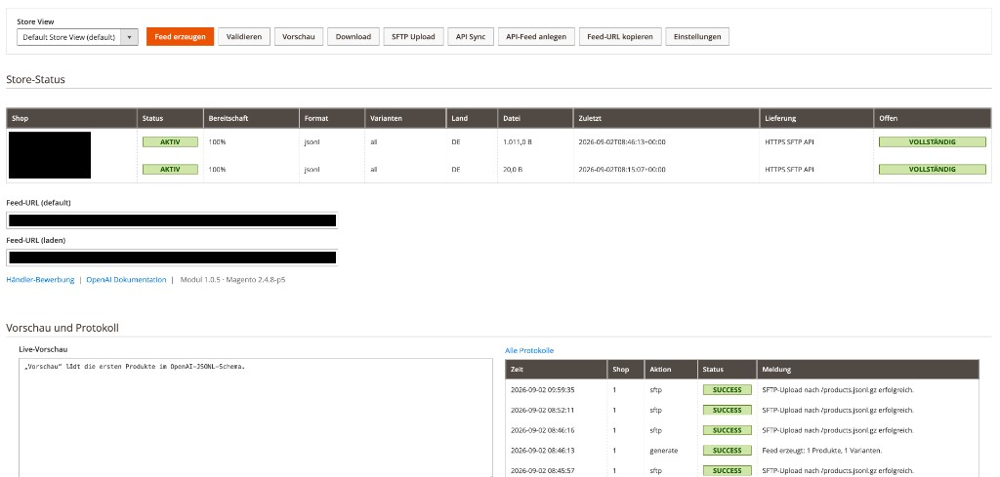
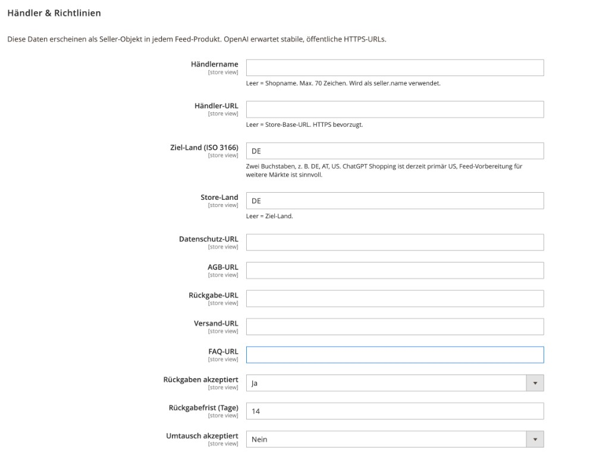
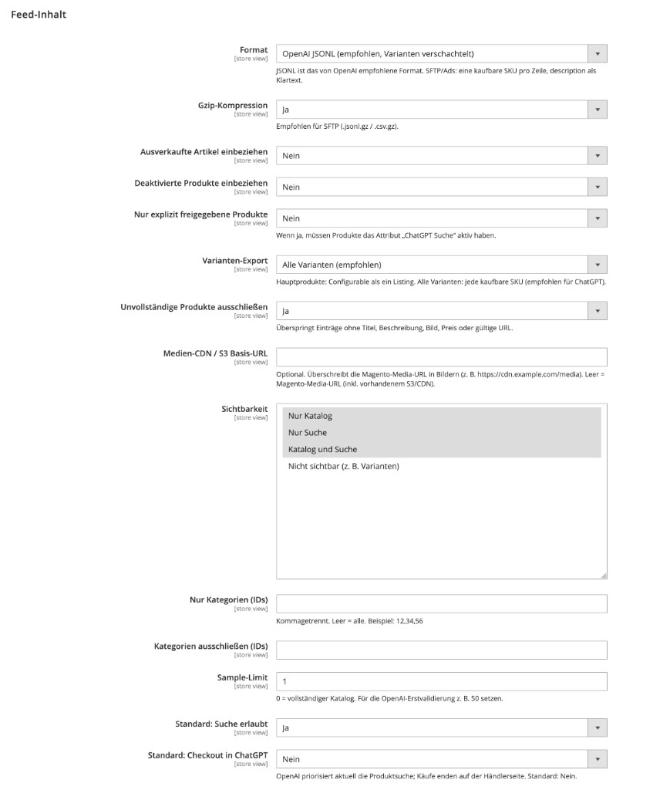
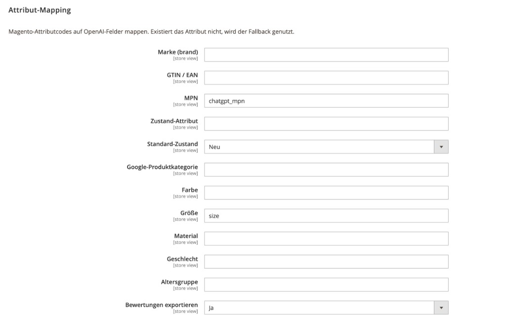
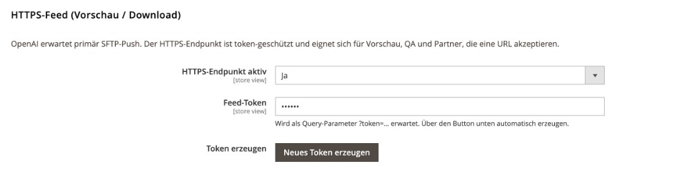
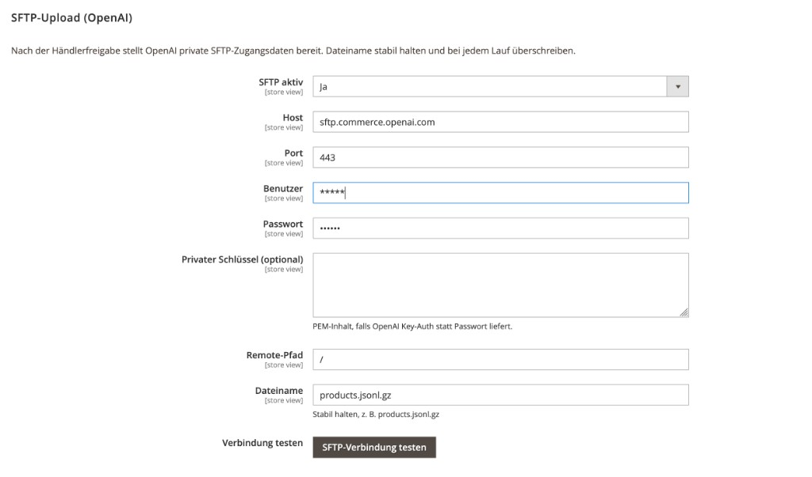
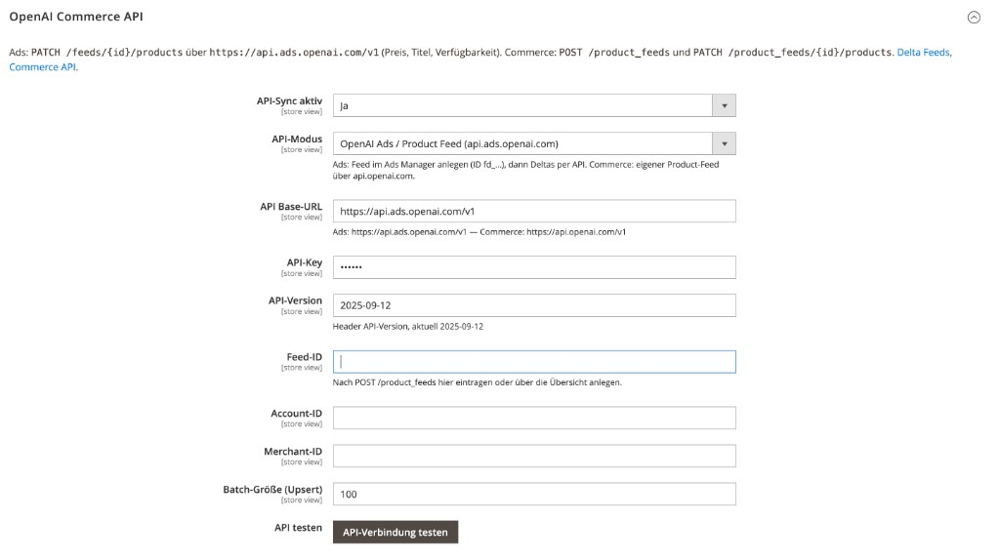
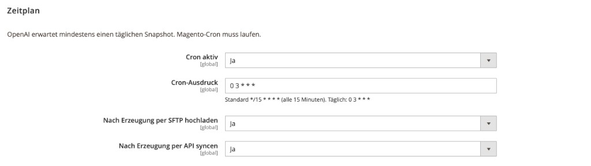
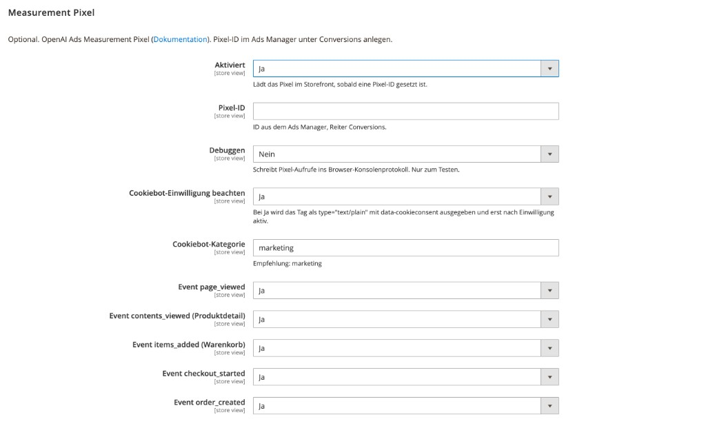

# Magento 2 ChatGPT Produktsuche / Product Search

[Deutsch](#deutsch) | [English](#english)

Modul für Magento Open Source und Adobe Commerce. Der Katalog geht als Produkt-Feed an die [ChatGPT-Produktsuche](https://chatgpt.com/de-DE/merchants/). Checkout und Zahlung bleiben im Shop.

Magento Open Source / Adobe Commerce module. The catalog is published as a product feed to [ChatGPT product search](https://chatgpt.com/merchants/). Checkout and payment stay in the shop.

Benötigt / requires [`solutioo/module-base`](https://github.com/solutioo365/M2_SolutiooBase).

---

# Deutsch

## Funktionen

- eigener Feed je Store View
- JSONL, CSV/TSV, optional Gzip
- HTTPS (Token), SFTP, OpenAI Ads-API oder Commerce-API
- Validierung, Varianten, Promotions, Reviews
- Übersicht, CLI, REST, Cron
- optionales Measurement Pixel

## Admin-Oberfläche

Pfad: **Solutioo → ChatGPT Produktsuche**. Die Einstellungen liegen unter **Einstellungen** bzw. Stores → Configuration → Solutioo → ChatGPT Produktsuche. Die meisten Felder sind je Store View setzbar.

### Übersicht



Die Übersicht ist die tägliche Arbeitsseite. Oben wählt man die Store View und startet die Aktionen per Hand: Feed erzeugen, gegen das OpenAI-Schema prüfen, Vorschau, Download, SFTP-Upload, API-Sync, API-Feed anlegen, Feed-URL kopieren.

Die Tabelle **Store-Status** zeigt je Store, ob das Modul aktiv ist, wie vollständig die Pflichtfelder sind, Format, Variantenmodus, Land, Dateigröße, letzter Lauf und welche Lieferwege (HTTPS, SFTP, API) greifen. Darunter stehen die token-geschützten Feed-URLs.

**Live-Vorschau** lädt die ersten Produkte im JSONL-Schema. **Protokoll** listet die letzten Läufe (Erzeugung, SFTP, API) mit Status und Meldung.

### Händler & Richtlinien



Diese Daten stehen in jedem Feed-Produkt als Seller-Objekt. OpenAI erwartet stabile, öffentliche HTTPS-URLs.

- **Händlername / Händler-URL:** leer = Shopname bzw. Store-Base-URL
- **Ziel-Land / Store-Land:** ISO-3166, z. B. `DE`
- **Datenschutz, AGB, Rückgabe, Versand, FAQ:** öffentliche Seiten
- **Rückgaben / Umtausch / Frist:** für die Darstellung in ChatGPT

Checkout bleibt im eigenen Shop.

### Feed-Inhalt



Hier legt man fest, *was* im Feed steht:

- **Format:** OpenAI JSONL (empfohlen, Varianten verschachtelt). Alternativ CSV/TSV.
- **Gzip:** für SFTP üblich (`products.jsonl.gz`)
- **Ausverkaufte / deaktivierte / nur freigegebene Produkte:** Filter vor dem Export
- **Varianten-Export:** alle kaufbaren SKUs oder nur das Hauptprodukt
- **Unvollständige ausschließen:** ohne Titel, Text, Bild, Preis oder URL nicht exportieren
- **Medien-CDN:** nur setzen, wenn Bilder nicht über die Magento-Media-URL erreichbar sind
- **Sichtbarkeit / Kategorien:** Katalogeinschränkung
- **Sample-Limit:** `0` = ganzer Katalog, eine kleine Zahl für die Erstprüfung bei OpenAI
- **Suche / Checkout in ChatGPT:** Standards, falls das Produktattribut leer ist

### Attribut-Mapping



Magento-Attributcodes auf die OpenAI-Felder legen. Existiert der Code nicht, greift der Fallback (z. B. `chatgpt_mpn` für MPN). Typische Felder: Marke, GTIN/EAN, MPN, Zustand, Google-Produktkategorie, Farbe, Größe, Material, Geschlecht, Altersgruppe. Bewertungen können mit exportiert werden.

Shop-spezifische Codes (eigene EAN-, Farb- oder Hersteller-Attribute) hier eintragen, nicht im Code hart verdrahten.

### HTTPS-Feed



OpenAI erwartet primär SFTP. Der HTTPS-Endpunkt ist für Vorschau, QA und Partner gedacht, die eine URL akzeptieren.

1. Endpunkt aktivieren
2. **Neues Token erzeugen**
3. URL mit `?token=…` aus der Übersicht kopieren

Ohne gültiges Token liefert der Endpunkt keinen Feed.

### SFTP-Upload



Nach der Händlerfreigabe liefert OpenAI private Zugangsdaten. Host ist in der Regel `sftp.commerce.openai.com`, Port oft `443`. Dateiname **stabil halten** und bei jedem Lauf überschreiben, z. B. `products.jsonl.gz`.

Passwort oder optional PEM-Schlüssel. **SFTP-Verbindung testen** prüft Login und Pfad, ohne den ganzen Katalog zu schreiben.

### OpenAI Commerce API



Zwei Modi:

- **Ads / Product Feed:** `https://api.ads.openai.com/v1`, Feed-ID aus dem Ads Manager (`fd_…`). Deltas (Preis, Titel, Verfügbarkeit) per `PATCH /feeds/{id}/products`. Neue Varianten legt die Ads-API nicht an — Erstkatalog per SFTP.
- **Commerce:** `https://api.openai.com/v1`, Feed per `POST /product_feeds` (Button **API-Feed anlegen** in der Übersicht) und danach Produkt-Patches.

Header-API-Version aktuell `2025-09-12`. Batch-Größe steuert, wie viele SKUs pro Request gehen. **API-Verbindung testen** prüft Key und Erreichbarkeit.

### Zeitplan



OpenAI erwartet mindestens einen täglichen Snapshot. Magento-Cron muss laufen.

- Standardvorschlag `*/15 * * * *` (alle 15 Minuten) oder täglich z. B. `0 3 * * *`
- optional nach jeder Erzeugung automatisch SFTP und/oder API

### Measurement Pixel



Optional, unabhängig vom Feed. Pixel-ID im Ads Manager unter Conversions anlegen, dann aktivieren.

- **Cookiebot:** Script als `text/plain` + `data-cookieconsent` (Standard `marketing`), startet erst nach Einwilligung
- Events einzeln: `page_viewed`, `contents_viewed` (PDP), `items_added`, `checkout_started`, `order_created`
- **Debuggen:** schreibt die Aufrufe in die Browser-Konsole

Ohne Pixel-ID wird nichts geladen.

## Voraussetzungen

- Magento 2.4 / Adobe Commerce 2.4
- PHP 8.1 oder neuer
- `solutioo/module-base` ^1.0
- laufender Magento-Cron
- Händlerzugang unter [chatgpt.com/merchants](https://chatgpt.com/de-DE/merchants/)

## Installation

### Composer

```bash
composer config repositories.solutioo composer https://www.solutioo.de/packages/
composer require solutioo/module-chatgpt-product-search
bin/magento module:enable Solutioo_Base Solutioo_ChatGptProductSearch
bin/magento setup:upgrade
bin/magento cache:flush
```

Alternativ direkt über GitHub (VCS):

```bash
composer config repositories.solutioo-chatgpt vcs https://github.com/solutioo365/M2_ChatGPTAds.git
composer require solutioo/module-chatgpt-product-search
```

### app/code

1. [Solutioo Base](https://github.com/solutioo365/magento-base) nach `app/code/Solutioo/Base`
2. dieses Modul nach `app/code/Solutioo/ChatGptProductSearch`
3. dieselben Magento-Befehle wie oben

## Einrichtung

1. Solutioo → ChatGPT Produktsuche → Einstellungen
2. Modul aktivieren, Händlername, Land, Datenschutz-/AGB-/Rückgabe-URL
3. Feed-Token erzeugen, Mapping prüfen
4. in der Übersicht Feed erzeugen und prüfen
5. nach der Freigabe durch OpenAI SFTP oder API eintragen
6. bei Bedarf Measurement Pixel aktivieren

Mehr Details: [docs/KONFIGURATION.md](docs/KONFIGURATION.md)

## CLI

```bash
bin/magento solutioo:chatgpt:feed:generate [--store=1] [--sftp] [--api]
bin/magento solutioo:chatgpt:feed:validate --store=1
bin/magento solutioo:chatgpt:feed:upload --store=1
bin/magento solutioo:chatgpt:feed:sync-api --store=1
bin/magento solutioo:chatgpt:feed:sync-api --store=1 --sku=ARTIKELNUMMER
bin/magento solutioo:chatgpt:feed:status
```

## REST

Recht `Solutioo_ChatGptProductSearch::api`:

- `POST /V1/solutioo/chatgpt/feed/generate/:storeId`
- `GET /V1/solutioo/chatgpt/feed/validate/:storeId`
- `GET /V1/solutioo/chatgpt/feed/status/:storeId`
- `POST /V1/solutioo/chatgpt/feed/sync-api/:storeId`
- `POST /V1/solutioo/chatgpt/feed/sftp/:storeId`

## Produktattribute

Gruppe **ChatGPT Produktsuche**:

| Attribut | Zweck |
|----------|--------|
| `chatgpt_search` | im Katalog anzeigen |
| `chatgpt_checkout` | Checkout über ChatGPT |
| `chatgpt_exclude` | aus dem Feed nehmen |
| `chatgpt_gtin` | GTIN/EAN-Fallback |
| `chatgpt_mpn` | MPN-Fallback |

## Dateien

Feeds liegen unter `var/chatgpt_feed/store_{id}/`.

Der HTTPS-Endpunkt `/chatgpt/feed?token=…&store=…` ist für Vorschau gedacht. Für den Live-Betrieb ist SFTP üblich.

## Events

- `solutioo_chatgpt_product_map_after`
- `solutioo_chatgpt_feed_generate_after`

## Support

- [www.solutioo.de](https://www.solutioo.de)
- info@solutioo.de

## Lizenz

OSL-3.0 / AFL-3.0

---

# English

## Features

- one feed per store view
- JSONL, CSV/TSV, optional gzip
- HTTPS (token), SFTP, OpenAI Ads API or Commerce API
- validation, variants, promotions, reviews
- dashboard, CLI, REST, cron
- optional measurement pixel

## Admin UI

Path: **Solutioo → ChatGPT Product Search**. Settings: **Settings** or Stores → Configuration → Solutioo → ChatGPT Product Search. Most fields are store-view scoped.

### Dashboard


This is the daily working screen. Pick a store view, then run actions by hand: generate feed, validate against the OpenAI schema, preview, download, SFTP upload, API sync, create API feed, copy feed URL.

**Store status** shows per store whether the module is on, how complete required fields are, format, variant mode, country, file size, last run, and which delivery paths (HTTPS, SFTP, API) are enabled. Token-protected feed URLs sit below the table.

**Live preview** loads the first products in the JSONL schema. **Log** lists recent generate / SFTP / API runs with status and message.

### Merchant & policies


These values appear as the seller object on every feed product. OpenAI expects stable public HTTPS URLs.

- **Merchant name / URL:** empty = shop name / store base URL
- **Target country / store country:** ISO 3166, e.g. `DE`
- **Privacy, terms, returns, shipping, FAQ:** public pages
- **Returns / exchanges / window:** used in ChatGPT presentation

Checkout stays on your site.

### Feed content


Controls *what* goes into the feed:

- **Format:** OpenAI JSONL (recommended, nested variants). CSV/TSV as alternatives
- **Gzip:** typical for SFTP (`products.jsonl.gz`)
- **Out of stock / disabled / allow-list only:** export filters
- **Variant export:** every buyable SKU or parent only
- **Skip incomplete:** drop rows without title, description, image, price or URL
- **Media CDN:** only if images are not reachable via the Magento media URL
- **Visibility / categories:** catalog limits
- **Sample limit:** `0` = full catalog, a small number for OpenAI’s first review
- **Search / checkout in ChatGPT:** defaults when the product attribute is empty

### Attribute mapping


Map Magento attribute codes to OpenAI fields. If a code does not exist, the fallback is used (e.g. `chatgpt_mpn` for MPN). Typical fields: brand, GTIN/EAN, MPN, condition, Google product category, color, size, material, gender, age group. Reviews can be exported.

Enter shop-specific codes here (custom EAN, color, manufacturer). Do not hard-code them.

### HTTPS feed


OpenAI primarily expects SFTP. The HTTPS endpoint is for preview, QA and partners that accept a URL.

1. Enable the endpoint
2. **Generate new token**
3. Copy the URL with `?token=…` from the dashboard

Without a valid token the endpoint does not serve the feed.

### SFTP upload


After merchant approval OpenAI provides private credentials. Host is usually `sftp.commerce.openai.com`, port often `443`. Keep the **filename stable** and overwrite it on every run, e.g. `products.jsonl.gz`.

Password or optional PEM key. **Test SFTP connection** checks login and path without writing the full catalog.

### OpenAI Commerce API


Two modes:

- **Ads / Product Feed:** `https://api.ads.openai.com/v1`, feed ID from Ads Manager (`fd_…`). Deltas (price, title, availability) via `PATCH /feeds/{id}/products`. The Ads API does not create new variants — first catalog via SFTP.
- **Commerce:** `https://api.openai.com/v1`, create a feed with `POST /product_feeds` (**Create API feed** on the dashboard), then patch products.

Header API version is currently `2025-09-12`. Batch size is SKUs per request. **Test API connection** checks the key and reachability.

### Schedule


OpenAI expects at least one daily snapshot. Magento cron must be running.

- Suggested default `*/15 * * * *` (every 15 minutes) or daily e.g. `0 3 * * *`
- optionally upload via SFTP and/or sync via API after each generate

### Measurement pixel


Optional and independent from the feed. Create a pixel ID in Ads Manager under Conversions, then enable it.

- **Cookiebot:** script as `text/plain` + `data-cookieconsent` (default `marketing`), starts only after consent
- Events: `page_viewed`, `contents_viewed` (PDP), `items_added`, `checkout_started`, `order_created`
- **Debug:** logs calls to the browser console

Nothing is loaded until a pixel ID is set.

## Requirements

- Magento 2.4 / Adobe Commerce 2.4
- PHP 8.1 or newer
- `solutioo/module-base` ^1.0
- working Magento cron
- merchant access at [chatgpt.com/merchants](https://chatgpt.com/merchants/)

## Installation

### Composer

```bash
composer config repositories.solutioo composer https://www.solutioo.de/packages/
composer require solutioo/module-chatgpt-product-search
bin/magento module:enable Solutioo_Base Solutioo_ChatGptProductSearch
bin/magento setup:upgrade
bin/magento cache:flush
```

Alternatively via GitHub (VCS):

```bash
composer config repositories.solutioo-chatgpt vcs https://github.com/solutioo365/M2_ChatGPTAds.git
composer require solutioo/module-chatgpt-product-search
```

### app/code

1. [Solutioo Base](https://github.com/solutioo365/magento-base) into `app/code/Solutioo/Base`
2. this module into `app/code/Solutioo/ChatGptProductSearch`
3. same Magento commands as above

## Setup

1. Solutioo → ChatGPT Product Search → Settings
2. Enable the module, set merchant name, country, privacy / terms / returns URLs
3. Generate a feed token, check the mapping
4. Generate and review the feed on the dashboard
5. After OpenAI approval, enter SFTP or API credentials
6. Enable the measurement pixel if needed

More detail: [docs/KONFIGURATION.md](docs/KONFIGURATION.md) (German)

## CLI

```bash
bin/magento solutioo:chatgpt:feed:generate [--store=1] [--sftp] [--api]
bin/magento solutioo:chatgpt:feed:validate --store=1
bin/magento solutioo:chatgpt:feed:upload --store=1
bin/magento solutioo:chatgpt:feed:sync-api --store=1
bin/magento solutioo:chatgpt:feed:sync-api --store=1 --sku=SKU
bin/magento solutioo:chatgpt:feed:status
```

## REST

ACL `Solutioo_ChatGptProductSearch::api`:

- `POST /V1/solutioo/chatgpt/feed/generate/:storeId`
- `GET /V1/solutioo/chatgpt/feed/validate/:storeId`
- `GET /V1/solutioo/chatgpt/feed/status/:storeId`
- `POST /V1/solutioo/chatgpt/feed/sync-api/:storeId`
- `POST /V1/solutioo/chatgpt/feed/sftp/:storeId`

## Product attributes

Group **ChatGPT Product Search**:

| Attribute | Purpose |
|-----------|---------|
| `chatgpt_search` | show in the catalog |
| `chatgpt_checkout` | checkout via ChatGPT |
| `chatgpt_exclude` | omit from the feed |
| `chatgpt_gtin` | GTIN/EAN fallback |
| `chatgpt_mpn` | MPN fallback |

## Files

Feeds are stored under `var/chatgpt_feed/store_{id}/`.

The HTTPS endpoint `/chatgpt/feed?token=…&store=…` is for preview. Live delivery is usually SFTP.

## Events

- `solutioo_chatgpt_product_map_after`
- `solutioo_chatgpt_feed_generate_after`

## Support

- [www.solutioo.de](https://www.solutioo.de)
- info@solutioo.de

## License

OSL-3.0 / AFL-3.0
